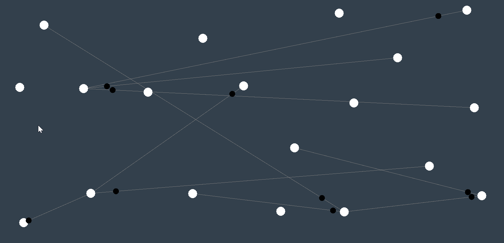
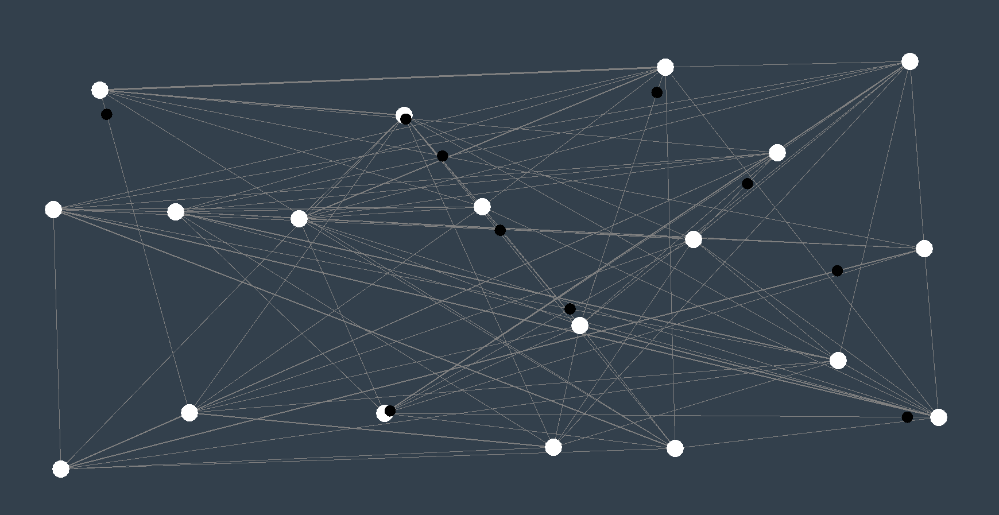

# Ants-Colony
This is a small simulation project made using LibGDX and java.

### What does it do?
The objective of this project is to generate numerous towns and distribute among those towns random ants,
each ant has a goal which is to visit ALL towns.

The ants trace all their steps and therefore we can see and deduct which routes are more active and which are less.
every time an ant repeat a movement that already has a trace, a thicker trace will appear.

### Controlling the simulation parameters
The entire simulation can be tweaked and modified in ColonySimulation.java class
 I have provided two generators, one for the ants and one for the towns.

Ant generator:
`AntGenerator antGenerator = new AntGenerator(world)`

to use the generator:
`antGenerator.withAnts(50).generate();`
generate returns list with ants.

Town generator:
`TownGenerator townGenerator = new TownGenerator(world)`
supported methods:

`townGenerator.withTowns(50) //How many towns should be created`

`townGenerator.withMinimumDistance(100) //Minimum distance between each town in pixels`

`townGenerator.withDeadzone(50) //Means that towns will spawn 50 pixels AWAY from screen borders.`

`townGenerator.withRetries(1000) //How many times should the code attempt to create towns ?`

###### Notes about generators: 
- They hold a default value, you can call .generate() straight away! :) 
- You can chain them! ie:`townGenerator().withDeadzone(20).withTowns(10).withRetries(10).generate()`

# Photos
Here we can see the first few seconds of the simulation. 
a white dot represent a town whilst a black one represent an ant.

remember - each ant must visit all towns.

after a few seconds the ants already visited most of the towns

we can see that some paths are thicker than others, this is because the ants travelled this paths more than the rest. 
the thicker the path - the more times it was walked on by an ant.

after the ants finished their movement, each would stop inside a town and report its total distance 
in the console you can see whats the shortest route and what is the longest.

### Extending further
This simulation can be further extended to optimize and find the best route possible.
This is "Ant Colony Optimization", each ant should react to the thickness of the traces and act accordingly,
if the trace is thick - favour that trace over other random ones. 
Randomness still has to be added inorder to find the best path.

after each iteration, take the ant with the shortest path, clone it numerous time and spread the ants over the board again,
eventually they should come to almost the shortest path possible between all towns.

###### Note! there is no guarantee that the path found was the shortest, however it is much faster to approximate it 
###### than brute forcing your way into finding it by calculating each and every possible town.

